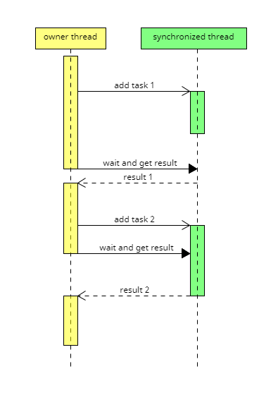

# synchronized_thread
A small library for serially executing tasks on a separate thread, with an abilty to wait for completion.

Depends only on the standard library. Custom tests.

Compilation tested in:
- MSVC 19.27.29110 for x64 (local) and MSVC 19.32.31329 (GitHub workflow)
- GCC 9.4 under Ubuntu 20.04 (local and GitHub workflow)
- Apple clang 12.0.0 (local), AppleClang 13.0.0 (GitHub workflow)

